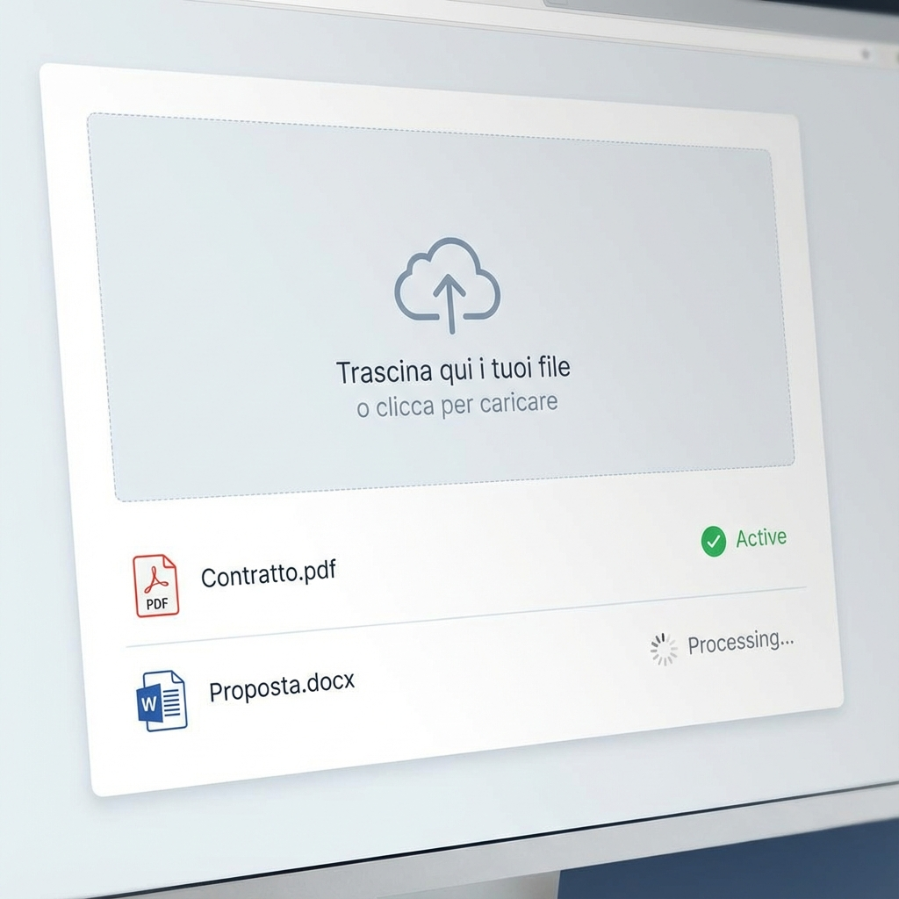
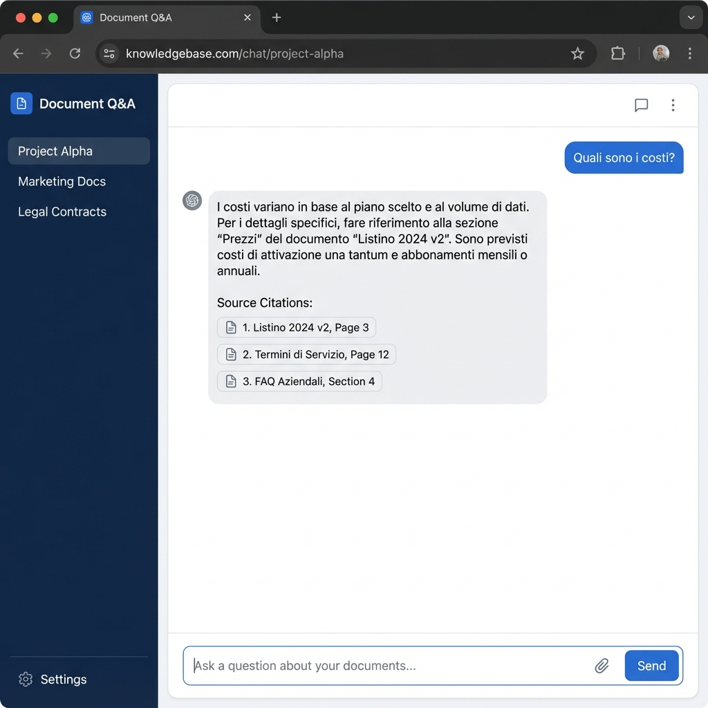

# 🚀 Quick Start Guide

Benvenuto nel **Sistema di Gestione Documenti con AI**! Questa guida ti aiuterà a iniziare in pochi minuti.

## 1. Accesso
Apri il tuo browser e vai all'indirizzo fornito dall'amministratore (es. `http://localhost:7001`).

## 2. Carica i tuoi Documenti
1. Clicca su **Documenti** nel menu laterale.
2. Trascina i tuoi file (PDF, Word, Excel) nell'area di upload o clicca per selezionarli.
3. Attendi che lo stato diventi ✅ `ACTIVE`.

## 3. Fai una Domanda
1. Vai alla sezione **Chat**.
2. Scrivi la tua domanda nella casella in basso (es. "Quali sono i costi nel preventivo X?").
3. Premi **Invio**.

## 4. Esplora i Risultati
- L'AI ti risponderà citando le fonti.
- Clicca sulle fonti per vedere i dettagli.

---
Per maggiori dettagli, consulta il [Manuale Utente Completo](User_Manual.md).
